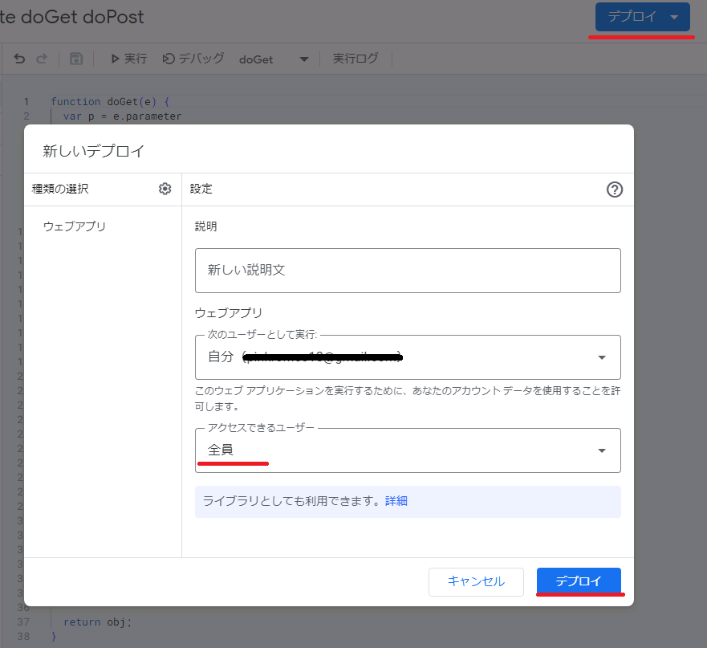
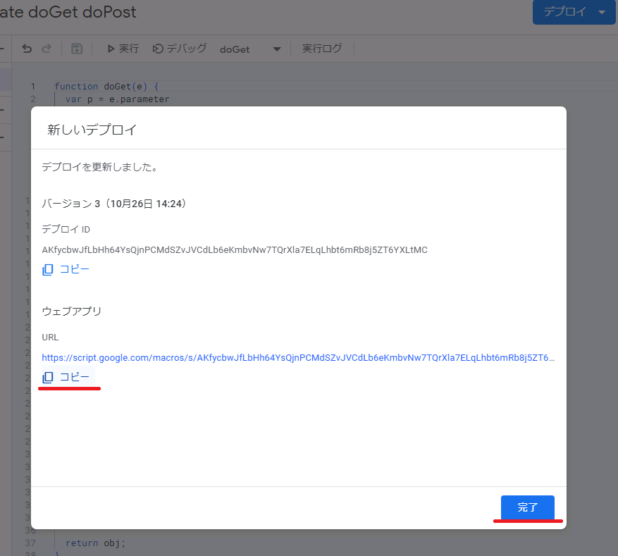

# GAS
GAS util

```js
import {GAS} from "https://pinkromeo18.github.io/GAS/GAS.js"
```

```js
var obj=GAS.toJSON(formElement)
```
```js
var res=await GAS.fetchGet(url,obj)
var res=await GAS.fetchPost(url,obj)
```

```js
/*
usage
*/

import {GAS} from "https://pinkromeo18.github.io/GAS/GAS.js"

console.log(GAS)

document.getElementById('submit').onclick=async (event)=>{  
  event.preventDefault();
  var obj=GAS.toJSON(document.querySelector('form'))
  console.log('toJSON',obj)
  
  var url="https://script.google.com/macros/s/AKfycbwZ-g3lD2-OG0Ku6olksgM7OwmYf-wUEYshyLrKVwzYDK6lFTIzl3ip9PGpLQmLzWsG/exec"
  
  var res=await GAS.fetchGet(url,obj)
   .then(d=>d.json())
  console.log('res fetchGet',res)

  var res2=await GAS.fetchPost(url,obj)
   .then(d=>d.json())
  console.log('res fetchPost',res2)
  
}

```


```js
//google action script

function doGet(e) {
  var p = e.parameter
  Logger.log('doGet')
  Logger.log(p)

  var res = calcGet(p)

  var output = ContentService.createTextOutput();
  output.setMimeType(ContentService.MimeType.JSON);
  output.setContent(JSON.stringify(res));

  return output;

}

function doPost(e) {
  var p = JSON.parse(e.postData.getDataAsString()); 
  Logger.log('doPost')
  Logger.log(p)

  var res = calcPost(p)

  var output = ContentService.createTextOutput();
  output.setMimeType(ContentService.MimeType.JSON);
  output.setContent(JSON.stringify(res));

  return output;
}

/////////////////////////////////////////////

function calcGet(obj){
  return obj;
}
function calcPost(obj){

  return obj;
}
```

#### deploy on google action script




